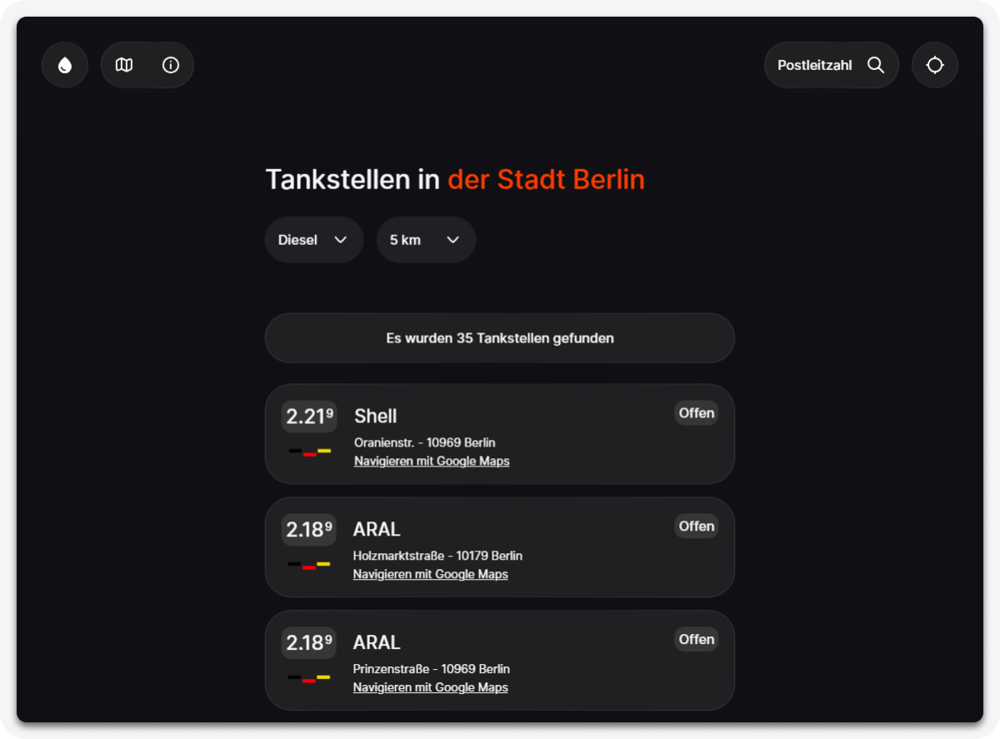
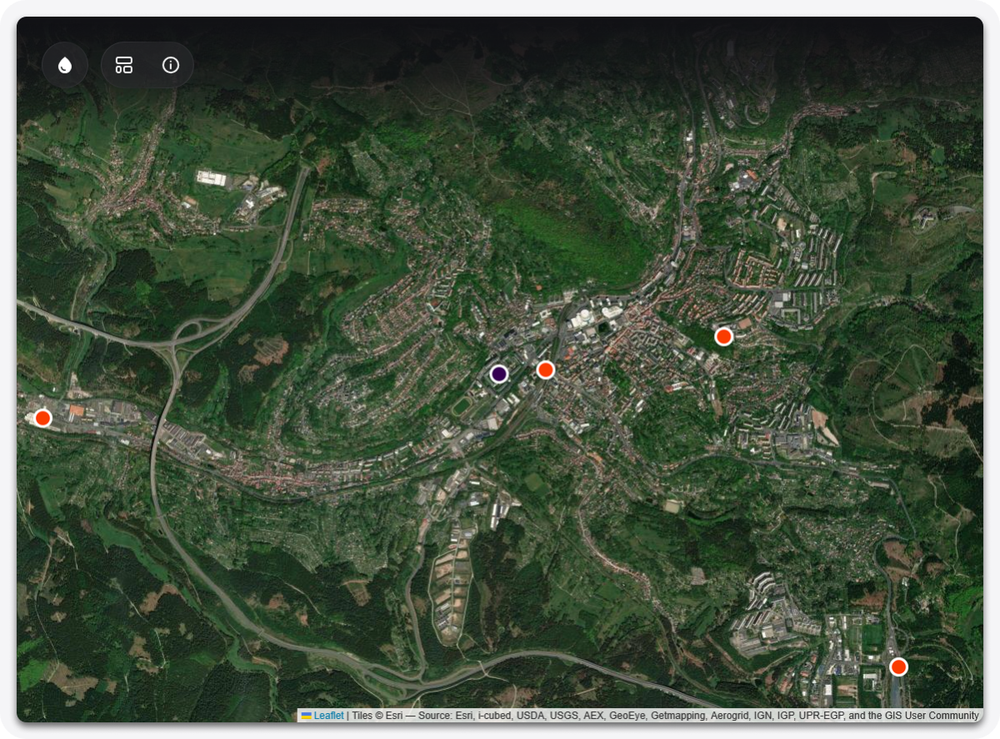

# TankRadar
Eine Info-Website, die dir aktuelle Kraftstoffpreise in deiner Nähe oder für eine Stadt deiner Wahl zeigt. Vielen Dank an [**Tankerkönig**](https://creativecommons.tankerkoenig.de/?page=info) für das Bereitstellen der Daten.

`tankradar.pages.dev/tankstellen:`

### Vergleiche aktuelle Preise für Diesel, E5 und E10 direkt in deiner Umgebung. Suche flexibel über deinen Standort, den Stadtnamen oder die Postleitzahl und passe den Suchradius ganz nach deinen Wünschen an.

`tankradar.pages.dev/map:`

### Behalte den Überblick dank der interaktiven Karte: Sieh dir alle verfügbaren Tankstellen im gewählten Umkreis direkt auf der Satelliten-Ansicht an und navigiere schnell zum günstigsten Preis.

> [!NOTE]
> Dir ist ein Fehler aufgefallen oder etwas funktioniert nicht wie erwartet? Hilf mit, TankRadar zu verbessern, und [erstelle ein Issue auf GitHub](https://github.com/lgloger/TankRadar/issues).
